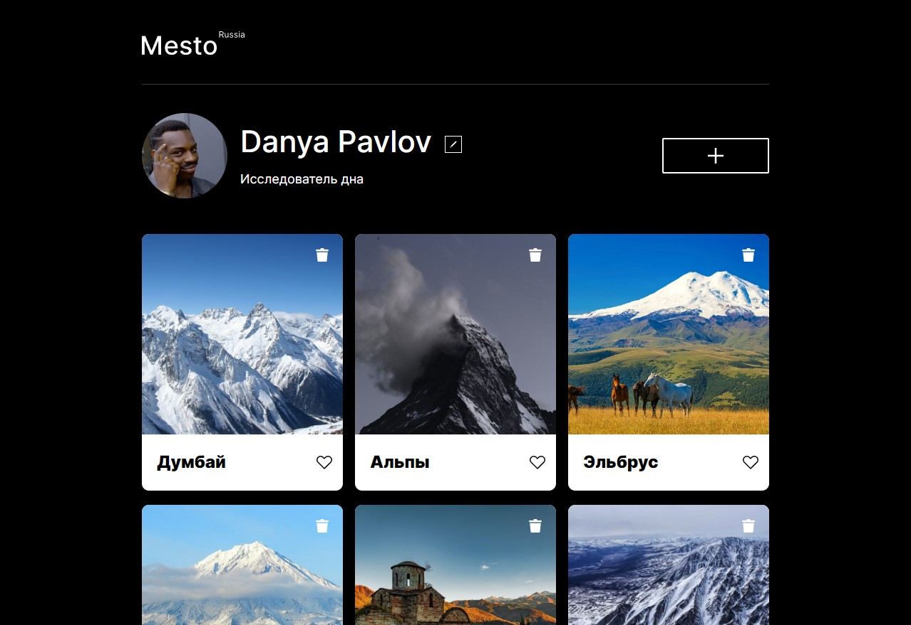
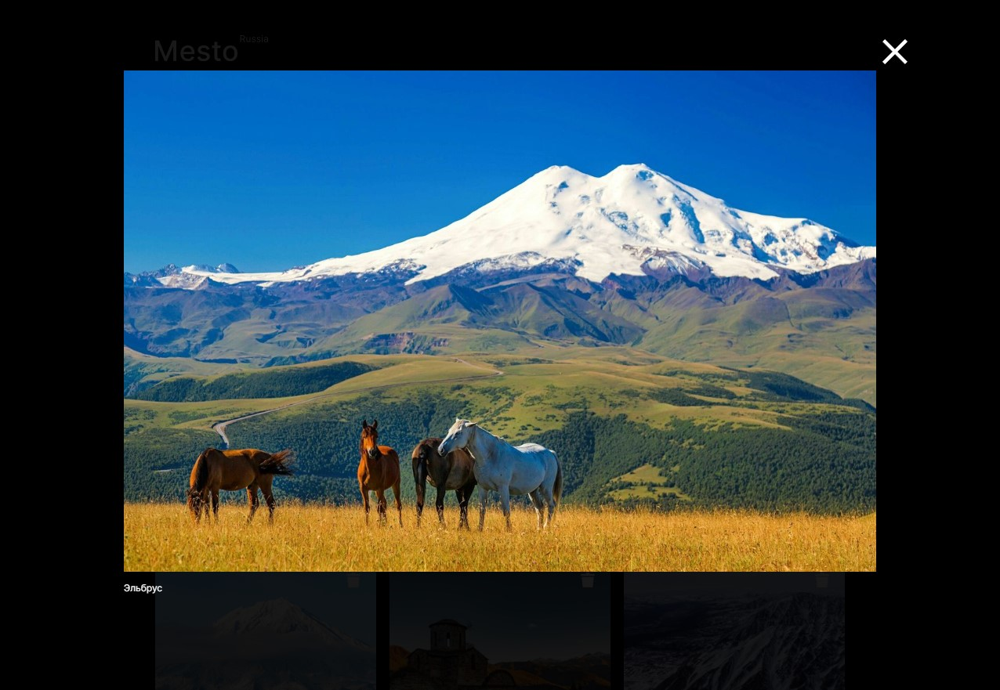

# Проект: Путешествие по России

### Установка
``` bash
$ git clone https://github.com/fRo0ne/project-mesto.git
$ npm run build
```

### Стэк
* CSS
* HTML
* JS

**Описание**

Сервис Mesto, продолжение изначального проекта. Реализация на JavaScript. Фронт часть. Возможность редактирования информации из профиля и добавление/удаление карточек на странице. Полное взаимодействие с сервером, валидация введенных данных.

**Линки**

* [Ссылка на макет в Figma](https://www.figma.com/file/2cn9N9jSkmxD84oJik7xL7/JavaScript.-Sprint-4?node-id=0%3A1)
* [Ссылка на проект](https://fro0ne.github.io/project-mesto/)

### Скриншот десктоп версии:



