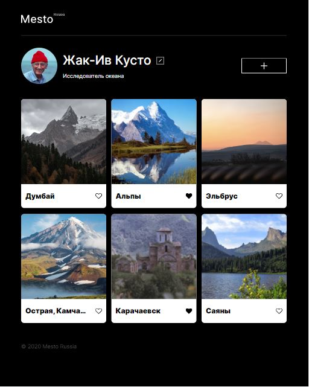
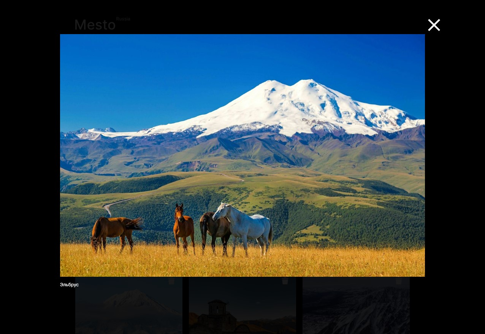
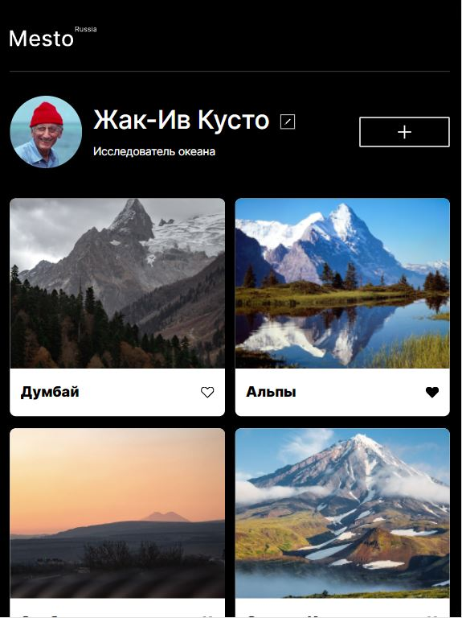
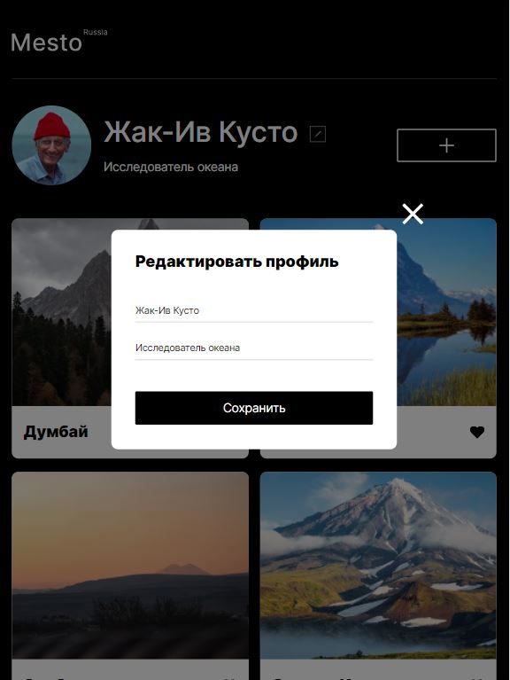
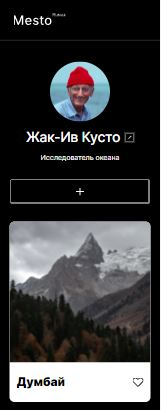
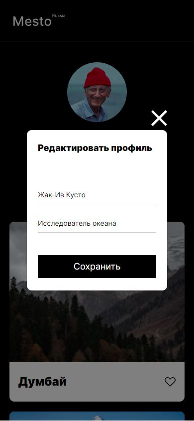

# Проект: Путешествие по России

### Установка
``` bash
$ git clone https://github.com/fRo0ne/project-mesto.git
```

### Стэк
* CSS
* HTML
* JS

**Описание**

Сервис Mesto, начальная стадия проекта. Адаптивная верстка по дизайну, так же добавлено пару событий в скрипт JS.

**Линки**

* [Ссылка на макет в Figma](https://www.figma.com/file/2cn9N9jSkmxD84oJik7xL7/JavaScript.-Sprint-4?node-id=0%3A1)
* [Ссылка на проект](https://fro0ne.github.io/project-mesto/)

**Скриншоты**

### Desktop:




### Tablet:




### Mobile:



